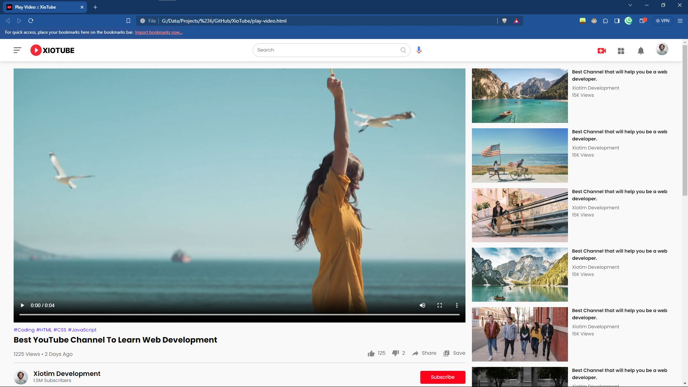

# XioTube :: A YouTube Clone

This  GitHub Repository is for XioTube - a clone of Youtube. This is basically just for me; and for you because you get free code and I get a good backup. You can change your Videos, Thumbnails, e.t.c as usual.

The pictures come from [here](https://drive.google.com/file/d/1EM5G-hccHjEwWunOfHkNALzPCqluLzxu/view)

**(thanks GreatStack!)**

## Acknowledgements

- Original Code written and shown on [GreatStack](https://www.youtube.com/@GreatStackDev)'s Channel
- Another Shoutout to: [XDT-XioTok](https://github.com/l-xdt/xiotok)
- Something that really helps in everything XDT has done: [DiffChecker](hhttps://www.diffchecker.com/)

## Authors

- [Liedenschaft-Xiotim Corp.](https://www.github.com/l-xdt)

- [Avun](https://github.com/avun-ai)

- [GreatStack](https://www.youtube.com/@GreatStackDev)

## Demo

This doesn't contain a demo, but you can find it on the address listed [here](https://l-xdt.github.io/xiotube/). Please do biist abd fork this GitHub Repo (or really, don't, I don't really care).

## Features

- Sidebar on play-video page.

- Fullscreen Mode

- You can customize how many likes and dislikes there are on the video.

- Cross platform (for Android & all browsers)

- Customize the Videos you see.

- **PS:** Please use 10K instaed of 15,000 or 1M instead of 1,000,000 for the best appearance.

## Screenshots




- **All Done in HTML, CSS and under 50 lines**

## Run Locally

Clone the project and Run it on XAMPP (**PS:** I would recomend a self-hosted domain for this step, it makes this process more satisfying and aesthetically pleasing.)

```bash
  git clone https://github.com/l-xdt/xiotube
```

Go to the project directory

```bash
  cd xiotube
```

Install XAMPP (via Choclatey ~ if you don't have it).

```bash
  choclately install xamp
```

Start the server

```bash
  [Directory]/[ServerName]/apache-start.bat
```

PS: Here is the manual on how to create a self-hosted domain: [here](https://www.youtube.com/watch?v=_eQGAJVtRCs) (By Soeng Song)

## Roadmap

- More Browser and intergrations to Android

- Having a banner for you to customize to your liking.

- Add as much videos as you would like to the platform - only viewable to ypi.

- Written by Hand.

- Written in Front-end languages (no frameworks, just vanilla): **HTML, CSS & JavaScript**.

- Still has the XT in the Style of (now) YouTube as the FavIcon in the folder ~ named Favicon (**truly..**).

## Support

For support, email either of our emails: [(one)](mailto:leidenschaft.tech@hotmail.com) or [(two)](mailto:trowesigames@gmail.com) or join our Discord Group (which may not be up as of writing this.).

## Feedback

This also is the same for Feedback - whether it be positive, or negative - you can give us constructive-critisism. No hate please., otherwise we encourage you to email us via either email [(one)](mailto:leidenschaft.tech@hotmail.com) or [(two)](mailto:trowesigames.com).

## FAQ

#### Can I change up, add or modify any of the code I would like?

Yeah! The project is for you. You are supposed to make it your own likes and tastes - for you to modify and to play around with. You may do whatever you would like with it basically.

#### Can I host this, if I can How?

I have said previously that you can host it on 127.0.0.1 (a.k.a your computer's ip). Use whatever you would like to host it. If you do find new findings we will update this slowly. But for this we reccomend XAMPP - eventhough hosting on WAMP is possible. 

Here are my two tutorials for hosting: mentioned earlier, how to host it yourself - linked [here](https://www.youtube.com/watch?v=LzucEZh4_no) and for more intermidiates, how to use it with a free domain online ~ as-long as you are not missing out on anything. linked [here](https://www.youtube.com/watch?v=_eQGAJVtRCs).

#### Any PS's for the questions

**PS:** You don't really need to host this on XAMPP just to use it you can just use it on the HTML alone, that is fine, but we really do recommend that...

## Used By

This project is used by the following companies:

- LeidenSchaft-Xiotim Corp.

- Studium Tools

- XDT (The Xiotim Development Team)

- noHesi

## Installation

Please, I insist install XAMP, if you want any instructions further, please refer to either the FAQ for links or the Run Locally.. please, I beg for the best experience.

```bash
  choclately install xampp
```

## Tech Stack

**Client:** HTML & CSS

**Server:** JavaScript & CDN's (if you want.)

## Related

Some related projects to the making of many replicas of popular websites:

- [XioTok](https://github.com/l-xdt/xiotok) by **(The Xiotim-Development Team)**

- [noHesi](https://github.com/l-xdt/no-hesi) by **(The Xiotim-Development Team)**

- [Studium](https://github.com/l-xdt/studium) by **(The Xiotim-Development Team)**

- [XioTim](https://github.com/l-xdt/xiotim) by **(The Xiotim-Development Team)**

## Documentation

- I cannot tell about all of the documentation, so please refer to:

- [GreatStack](https://www.youtube.com/watch?v=4ykAepVkG5Y)'s Tutorial

## API Reference

This doesn't use any APIs or Frameworks, so it doesn't need any APIs, very surface-level project, if it needs any more I will make sure to be telling you in the future updates or READ-MEs.
